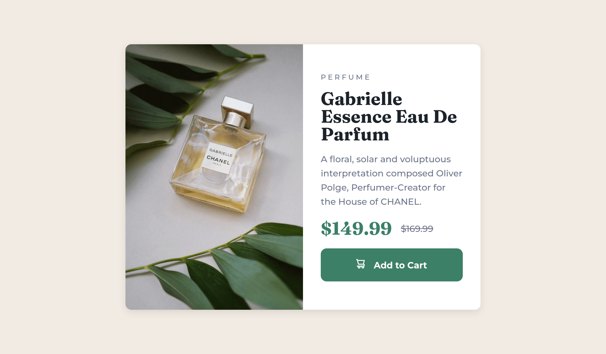

# Frontend Mentor - Product preview card component solution

This is a solution to the [Product preview card component challenge on Frontend Mentor](https://www.frontendmentor.io/challenges/product-preview-card-component-GO7UmttRfa). Frontend Mentor challenges help you improve your coding skills by building realistic projects. 

## Table of contents

  - [Screenshot](#screenshot)
  - [Links](#links)
  - [Built with](#built-with)
  - [What I learned](#what-i-learned)
  - [Useful resources](#useful-resources)
- [Author](#author)

### Screenshot

### Links

- [Solution URL](https://www.frontendmentor.io/challenges/product-preview-card-component-GO7UmttRfa/hub)
- [Live Site URL](https://bytepack-frontendmentor-product-preview.pages.dev/)

### Built with

- HTML5
- CSS3

### What I learned

Once an image streches (like in this project with flexbox, with default align-items: stretch) or when a height defined for it,  object-fit: cover; can be used to maintain the aspect ratio.

### Useful resources

- [Box shadow](https://getcssscan.com/css-box-shadow-examples) - quickly find a beautiful box shadow

## Author

- Frontend Mentor - [@bytepack](https://www.frontendmentor.io/profile/bytepack)
